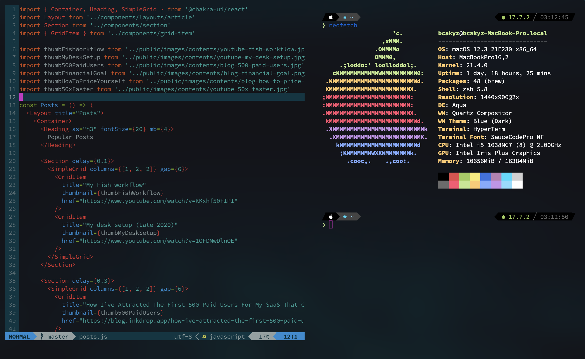

<div align="center">
<h1>Spirit Ship Dotfiles</h1>
</div>

<div align="center">

</div>


<div align="center">
<i>logo made by <a href="https://github.com/bcakyz-io">@bcakyz</a></i>
</div>

<br/>

<div align="center">

</div>

## Shell Setup

- [Fish shell](https://fishshell.com/)
- [Fisher](https://github.com/jorgebucaran/fisher) - Plugin manager
- [Tide](https://github.com/IlanCosman/tide) - Shell theme. Use version 5: `fisher install ilancosman/tide@v5`
- [Nerd fonts](https://github.com/ryanoasis/nerd-fonts) - Powerline-patched fonts. I use Hack.
- [z for fish](https://github.com/jethrokuan/z) - Directory jumping
- [Exa](https://the.exa.website/) - `ls` replacement
- [ghq](https://github.com/x-motemen/ghq) - Local Git repository organizer
- [peco](https://github.com/peco/peco) - Interactive filtering

------------------------------------------------

## NeoVim Setup

```zsh
brew install neovim
npm install tree-sitter cli
brew install luajit
```

- [Vim-Plug](https://github.com/junegunn/vim-plug) - minimalist plugin manager
- [nvim-lspconfig](https://github.com/neovim/nvim-lspconfig) - A collection of configurations for Neovim's built-in LSP
- [nvim-treesitter](https://github.com/nvim-treesitter/nvim-treesitter) - [Treesitter](https://github.com/tree-sitter/tree-sitter) configurations and abstraction layer for Neovim
- [nvim-cmp](https://github.com/hrsh7th/nvim-cmp) - A completion plugin for neovim coded in Lua
- [lspsaga.nvim](https://github.com/tami5/lspsaga.nvim) - A light-weight LSP plugin based on Neovim built-in LSP with highly a performant UI
- [telescope.nvim](https://github.com/nvim-telescope/telescope.nvim) - A highly extendable fuzzy finder over lists
- [defx.nvim](https://github.com/Shougo/defx.nvim) - A file explorer

------------------------------------------------

## Vscode Plugins

- [Spirit Ship Pack](https://marketplace.visualstudio.com/items?itemName=bcakyz.spiritship-pack) 
This package covers all the needs of a full stack developer

